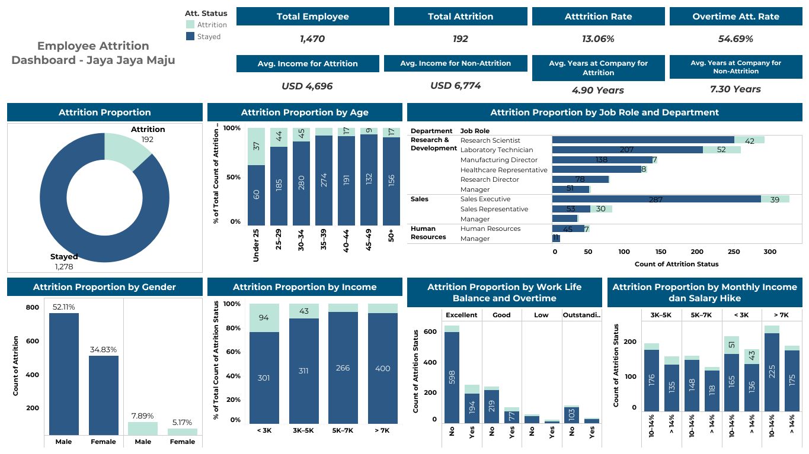

# HR Employee Attrition Problem

## Business Understanding
Perusahaan multinasional Jaya Jaya Maju, yang telah beroperasi sejak tahun 2000 dan memiliki lebih dari 1000 karyawan, tengah menghadapi tantangan serius dalam mengelola retensi karyawan. Tingkat attrition (rasio karyawan yang keluar dibanding total karyawan) telah menembus angka 13%, yang berdampak pada stabilitas operasional dan potensi kerugian sumber daya. Tingginya angka attrition ini menimbulkan kekhawatiran di kalangan manajemen, khususnya di divisi Human Resources (HR). Oleh karena itu, tim HR memerlukan analisis mendalam dan visualisasi interaktif guna:
- Mengidentifikasi faktor-faktor yang berkontribusi terhadap keputusan karyawan untuk keluar.
- Mengembangkan strategi pencegahan berbasis data.
- Memonitor tren dan pola attrition secara real-time melalui dashboard.

## Business Problem
Manajemen HR ingin menjawab pertanyaan-pertanyaan berikut:
- Apa karakteristik umum karyawan yang keluar (usia, jenis kelamin, pendapatan, jabatan, dll)?
- Bagaimana pengaruh faktor internal perusahaan seperti overtime, salary hike, dan work-life balance terhadap attrition?
- Departemen atau job role mana yang paling terdampak oleh attrition?
- Adakah ketimpangan pendapatan atau jenjang karir yang berkaitan dengan keputusan keluar?

## Project Goals
- Menganalisis pola dan tren employee attrition berdasarkan karakteristik demografis, peran, dan faktor internal.
- Mengidentifikasi faktor-faktor utama yang paling berkorelasi terhadap attrition.
- Membuat dashboard bisnis interaktif yang dapat digunakan oleh tim HR untuk memantau dan mengantisipasi risiko attrition.
- Memberikan insight dan rekomendasi berbasis data yang dapat ditindaklanjuti untuk menurunkan attrition rate.

## Project Scope
- Dataset yang dianalisis mencakup informasi demografi, job role, kompensasi, dan faktor kepuasan kerja dari 1470 karyawan.
- Fokus utama analisis adalah membedakan antara karyawan yang keluar (Attrition = Yes) dan yang bertahan (Attrition = No).
- Pembuatan dashboard mencakup metrik utama seperti:
1. Total Attrition Rate
2. Rata-rata Pendapatan
3. Distribusi berdasarkan usia, pendapatan, job role, overtime, dan lainnya

## Preparation
Sumber data: [Data Employee Attrition](https://github.com/dicodingacademy/dicoding_dataset/tree/main/employee)<br>
Setup environment:
1. Clone Repository
```bash
git clone https://github.com/hildanida/HR-Problem-Employee-Attrition.git
```
2. Creat Virtual Environment
```bash
# Windows
python -m venv env
env\Scripts\activate

# Mac/Linux
python3 -m venv env
source env/bin/activate
```
3. Install Library
```bash
pip install -r requirements.txt
```
4. Library Used
```bash
# Untuk analisis data
import pandas as pd
import numpy as np

# Untuk visualisasi
import matplotlib.pyplot as plt
import seaborn as sns
import plotly.express as px

# Untuk dashboard interaktif
import streamlit as st
```

## Business Dashboard

Dashboard ini [Employee Attrition Dashboard](https://public.tableau.com/views/employee-attrition/Dashboard1?:language=en-US&:sid=&:redirect=auth&:display_count=n&:origin=viz_share_link) merupakan visualisasi menyeluruh untuk memahami pola dan faktor-faktor yang berkaitan dengan *attrition* (keluar dari perusahaan) di Jaya Jaya Maju. Dashboard ini mencakup total karyawan, tingkat attrition, perbandingan pendapatan, serta distribusi attrition berdasarkan usia, jenis kelamin, pendapatan, jabatan, departemen, keseimbangan kerja, hingga overtime.

Dari visualisasi ini, kita bisa melihat bahwa attrition lebih sering terjadi pada karyawan dengan pendapatan rendah, durasi kerja yang lebih singkat, dan beban kerja lebih tinggi (terlihat dari proporsi overtime). Role seperti *Sales Executive* dan *Laboratory Technician* juga menunjukkan angka keluar yang tinggi. Temuan-temuan ini dapat menjadi dasar bagi tim HR untuk mengambil langkah strategis dalam meningkatkan retensi karyawan.

Berdasarkan dashboard, terlihat bahwa attrition lebih banyak terjadi pada karyawan pria, khususnya yang berusia di bawah 30 tahun dan memiliki pendapatan di bawah 3.000 USD. Salah satu faktor paling mencolok adalah *overtime*—lebih dari separuh karyawan yang keluar ternyata bekerja lembur secara rutin. Selain itu, tingkat kepuasan terhadap work-life balance dan job satisfaction yang rendah juga tampak selaras dengan tingginya angka attrition. Dari sisi jabatan, posisi *Sales Executive* dan *Laboratory Technician* memiliki tingkat keluar yang cukup tinggi dibanding peran lainnya, yang bisa menjadi indikator beban kerja atau tekanan yang lebih besar pada posisi tersebut. Insight ini mengarah pada pentingnya perhatian lebih terhadap keseimbangan kerja, kebijakan kompensasi, dan lingkungan kerja di jabatan-jabatan tertentu untuk menekan angka attrition ke depan.

## Conclusion
1. Tingkat Attrition perusahaan cukup tinggi (~13%), dengan lebih dari setengah karyawan yang keluar memiliki pola kerja lembur (OverTime = Yes).
2. Karyawan dengan pendapatan rendah (<3K USD), usia muda (< 30 tahun), dan masa kerja singkat (< 5 tahun) cenderung lebih rawan keluar.
3. Role yang paling berisiko attrition tinggi adalah Sales Executive, Laboratory Technician, dan Research Director. Hal ini muncul di koefisien model (onehot_OverTime_Yes, onehot__JobRole_Research Director, onehot__JobRole_Sales Executive, dll) dan juga di plot SHAP.
4. Faktor non-teknis—seperti status lajang (Single), frekuensi dinas/ travel tinggi, dan work-life balance yang rendah—juga memberikan kontribusi signifikan terhadap keputusan keluar karyawan.
5. Model prediktif (Logistic Regression + SHAP) menunjukkan OverTime sebagai driver terkuat, diikuti oleh aspek jabatan, marital status, dan metrik tenure (YearsWithCurrManager, YearsAtCompany).

## Recommendation
1. Kurangi Beban Lembur
- Tinjau kebijakan lembur: batasi jam lembur per minggu, atur rotasi tugas agar beban kerja lebih merata.
- Terapkan sistem insentif/bonus lembur agar karyawan merasa dihargai—jika lembur tidak bisa dihindari.
2. Penyesuaian Kompensasi
- Naikkan gaji atau tunjangan untuk segmen pendapatan < 5K USD, khususnya di role Sales & Lab Technician.
- Pertimbangkan bonus retention atau program pengakuan (recognition program) untuk role berisiko tinggi.
3. Perbaiki Work-Life Balance & Kepuasan Kerja
- Sediakan opsi fleksibilitas jam kerja (flextime), hybrid/remote working, atau cuti tambahan.
- Lakukan survei kepuasan rutin untuk menangkap isu job satisfaction dan environment satisfaction lebih dini.
4. Fokus pada Role High-Risk
- Buat program mentoring atau career-path khusus untuk Sales Executive, Research Director, dan Lab Technician.
- Sediakan pelatihan manajerial bagi atasan langsung—karena hubungan dengan manajer (YearsWithCurrManager) juga berpengaruh pada retensi.
5. Dukung Karyawan Muda & Lajang
- Tawarkan program onboarding dan buddy system untuk karyawan baru/ muda agar cepat beradaptasi.
- Fasilitasi kegiatan sosial atau komunitas karyawan untuk meningkatkan engagement, terutama bagi yang status Single.
6. Implementasi Monitoring & Predictive Alert
- Integrasikan model prediktif ke dashboard HR untuk memantau “early warning” (misal: kombinasi overtime + low satisfaction).
- Set up notifikasi otomatis ketika skor risiko attrition melewati threshold tertentu, sehingga tim HR bisa proaktif menindaklanjuti.
